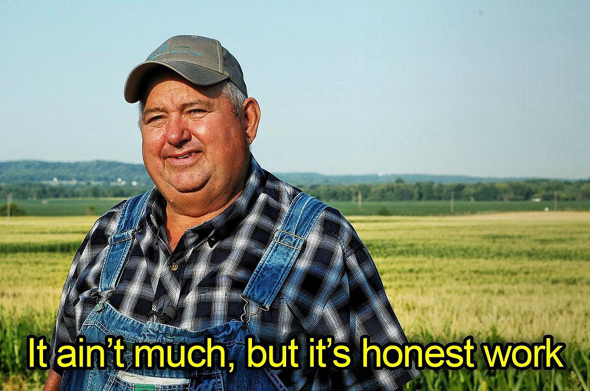

### 👋 Hi, I’m Kavi
🌱 I’m in my 3rd year of University studying Software Engineering.

👀 Technology has always been a passion of mine since I was a kid. It started out with me flashing custom ROMs on my Android phone and installing different operating systems on my moms old HP. Programming has been a newfound interest of mine and I've been loving it ever since. I'm currently learning React.js development with Next.js in my free time. I also recently got into hosting my own home server.

📫 You can reach me on [LinkedIn](https://www.linkedin.com/in/kaviraj-vijayanthiran-a4aa9b240).

👨‍💻 Check out my pinned projects below!

<!--- - ⚡ Fun fact: ... --->

<!---
KaviV23/KaviV23 is a ✨ special ✨ repository because its `README.md` (this file) appears on your GitHub profile.
You can click the Preview link to take a look at your changes.
--->
